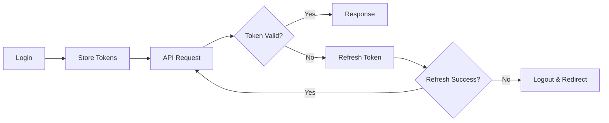

# 🔌 API Integration Guide

Complete documentation for all backend API endpoints integrated in this frontend.

## 🌐 Base Configuration

The API base URL is configured via environment variable:

```env
VITE_API_BASE_URL=http://localhost:8000/api
```

All API calls are made through `src/services/api.js` which handles:
- JWT token injection
- Automatic token refresh
- Error handling
- Request/response interceptors

## 📡 API Endpoints

### 🔐 Authentication APIs

#### Register User
```javascript
POST /api/auth/register
Body: { name, email, password }
Response: { access_token, refresh_token, user }
```

#### Login
```javascript
POST /api/auth/login
Body: { email, password }
Response: { access_token, refresh_token, user }
```

#### Google OAuth
```javascript
GET /api/auth/google
Redirects to Google OAuth consent screen
```

#### Google Callback
```javascript
GET /api/auth/google/callback?code=...
Returns: JWT tokens via query params
```

#### Get Current User
```javascript
GET /api/auth/me
Headers: Authorization: Bearer <token>
Response: { id, name, email, xp, level, role }
```

#### Logout
```javascript
POST /api/auth/logout
Headers: Authorization: Bearer <token>
```

#### Refresh Token
```javascript
POST /api/auth/refresh
Body: { refresh_token }
Response: { access_token }
```

### 🎯 Skill Gap Analysis

#### Analyze Resume
```javascript
POST /api/skill-gap/analyze
Content-Type: multipart/form-data
Body: 
  - resume: PDF file
  - job_description: string (optional)
Response: {
  current_skills: string[],
  skill_gaps: string[],
  recommendations: string
}
```

### 🗺️ Roadmap APIs

#### Get All Roadmaps
```javascript
GET /api/roadmaps
Headers: Authorization: Bearer <token>
Response: [{ id, target_role, nodes, created_at }]
```

#### Generate Roadmap
```javascript
POST /api/roadmaps/generate
Body: {
  target_role: string,
  skill_gaps: string[],
  current_skills: string[]
}
Response: { id, target_role, nodes, created_at }
```

#### Get Single Roadmap
```javascript
GET /api/roadmaps/:id
Response: { id, target_role, nodes, created_at }
```

#### Delete Roadmap
```javascript
DELETE /api/roadmaps/:id
Response: { message: "Roadmap deleted" }
```

#### Get YouTube Videos
```javascript
GET /api/roadmaps/:id/videos?skill=Python
Response: { videos: [{ video_id, title, channel }] }
```

### 📊 Progress APIs

#### Start Node Progress
```javascript
POST /api/progress/start
Body: { roadmap_id, node_id }
Response: { id, status: "in_progress" }
```

#### Complete Node
```javascript
POST /api/progress/:id/complete
Response: { 
  status: "completed",
  xp_earned: 50,
  new_level: 5
}
```

#### Track Video Watched
```javascript
POST /api/progress/:id/track-video
Body: { video_id: string }
Response: { videos_watched: number }
```

#### Get Roadmap Progress
```javascript
GET /api/progress/roadmap/:roadmapId
Response: [{
  id,
  node_id,
  status,
  videos_watched
}]
```

### 🏆 Certificate APIs

#### Get All Certificates
```javascript
GET /api/certificates
Response: [{
  id,
  roadmap_id,
  issued_date,
  verification_url
}]
```

#### Generate Certificate
```javascript
POST /api/certificates/generate/:roadmapId
Response: { id, pdf_url, qr_code }
```

#### Verify Certificate (Public)
```javascript
GET /api/certificates/verify/:id
No authentication required
Response: {
  id,
  user_name,
  roadmap_name,
  issued_date,
  is_valid: true
}
```

#### Download Certificate PDF
```javascript
GET /api/certificates/:id/download
Returns: PDF file
```

### 🎮 Gamification APIs

#### Get Leaderboard
```javascript
GET /api/gamification/leaderboard?timeframe=all_time
Query params:
  - timeframe: all_time | monthly | weekly
Response: {
  leaderboard: [{
    rank,
    user_id,
    name,
    xp,
    level
  }]
}
```

#### Get Badges
```javascript
GET /api/gamification/badges
Response: {
  badges: [{
    id,
    name,
    description,
    earned_at
  }]
}
```

#### Get User Stats
```javascript
GET /api/gamification/stats
Response: {
  xp,
  level,
  streak,
  badges_earned
}
```

### 👑 Admin APIs

#### Get All Users
```javascript
GET /api/admin/users?page=1&limit=10
Requires: Admin role
Response: {
  users: [{
    id,
    name,
    email,
    xp,
    level,
    created_at
  }],
  total,
  page
}
```

#### Get System Stats
```javascript
GET /api/admin/stats
Requires: Admin role
Response: {
  total_users,
  total_roadmaps,
  total_certificates,
  active_today
}
```

## 🔒 Authentication Flow



## 🛠️ Usage Examples

### Making API Calls

```javascript
import { authAPI, roadmapAPI } from './services/api'

// Login
const loginUser = async () => {
  try {
    const { data } = await authAPI.login({
      email: 'user@example.com',
      password: 'password123'
    })
    localStorage.setItem('accessToken', data.access_token)
  } catch (error) {
    console.error(error.response?.data?.message)
  }
}

// Generate Roadmap
const generateRoadmap = async () => {
  try {
    const { data } = await roadmapAPI.generate({
      target_role: 'Full Stack Developer',
      skill_gaps: ['React', 'Node.js'],
      current_skills: ['JavaScript', 'HTML', 'CSS']
    })
    console.log('Roadmap created:', data.id)
  } catch (error) {
    console.error(error)
  }
}
```

## 🚨 Error Handling

All API errors return:

```javascript
{
  message: "Error description",
  status: 400 // HTTP status code
}
```

Common status codes:
- `400` - Bad Request (validation error)
- `401` - Unauthorized (invalid/expired token)
- `403` - Forbidden (insufficient permissions)
- `404` - Not Found
- `500` - Internal Server Error

## 📝 Notes

- All protected endpoints require `Authorization: Bearer <token>` header
- Token refresh is automatic (handled by axios interceptor)
- File uploads use `multipart/form-data`
- All timestamps are ISO 8601 format
- Pagination uses `page` and `limit` query params

---

Need help? Check the [README.md](README.md) or open an issue.
